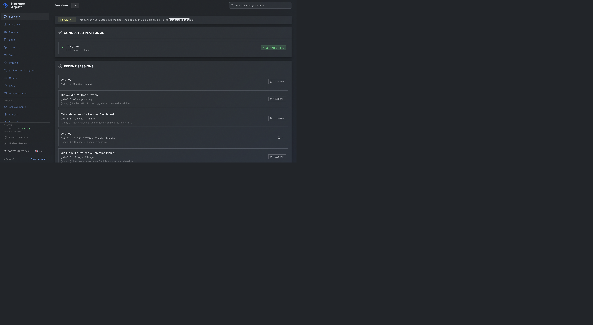
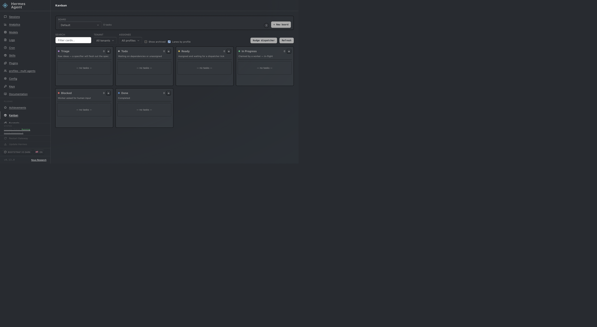
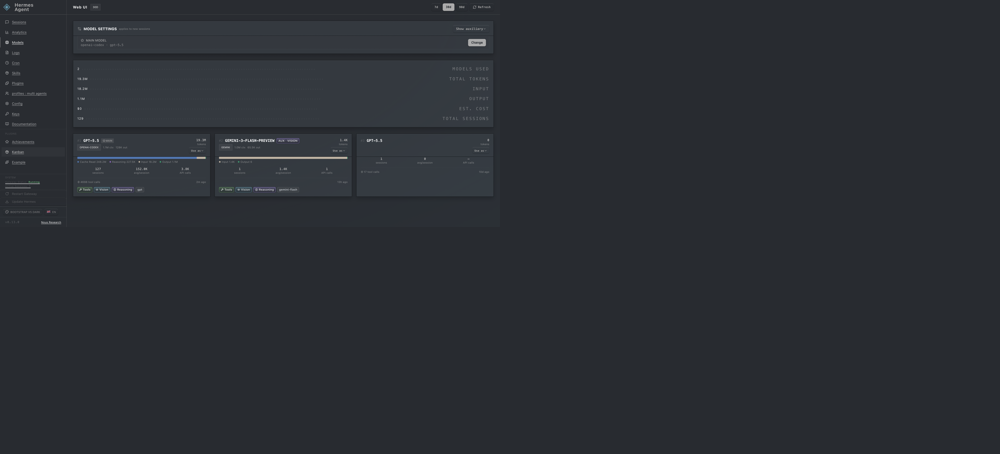
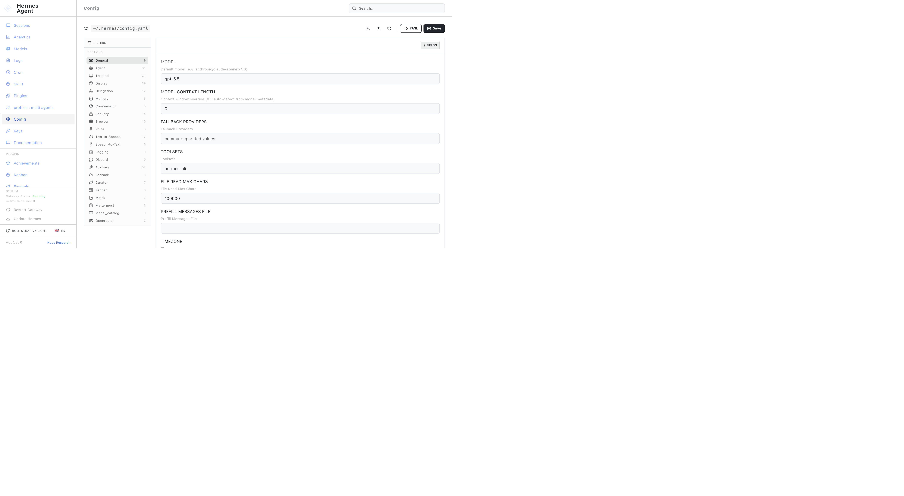
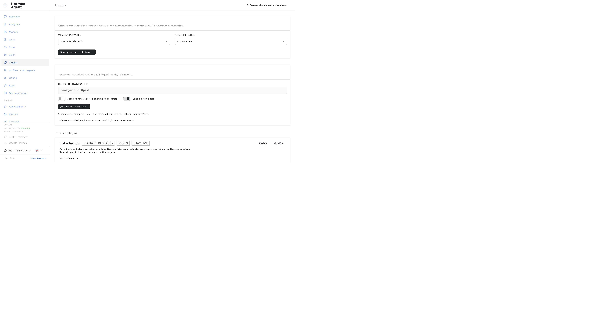

# Hermes Dashboard Bootstrap Themes

Polished Bootstrap 5-inspired light and dark themes for the Hermes Agent web dashboard.

This pack keeps Hermes' dashboard portable and local-first while making the UI feel closer to Bootstrap 5.3 defaults: native system fonts, Bootstrap color tokens, predictable radius, readable forms, visible focus rings, and lower visual noise for daily use.

## Themes

- `bootstrap-v5-light.yaml` — clean Bootstrap light mode with white cards, Bootstrap blue accents, and low-noise background treatment.
- `bootstrap-v5-dark.yaml` — Bootswatch Slate-inspired dark mode with graphite surfaces, white links, gray body text, Slate component colors, and Bootstrap-style high-contrast inputs.

## Install

Clone or download this repository, then copy the theme files into Hermes' dashboard theme directory:

```bash
mkdir -p ~/.hermes/dashboard-themes
cp themes/bootstrap-v5-*.yaml ~/.hermes/dashboard-themes/
```

Restart or refresh the Hermes dashboard, then use **Switch theme** in the dashboard sidebar and select either:

- Bootstrap v5 Light
- Bootstrap v5 Dark

If your dashboard is not already running:

```bash
hermes dashboard
```

By default the dashboard is available at <http://127.0.0.1:9119>.

## Validate locally

The theme files are plain YAML. Validate them before installing or after editing:

```bash
ruby -e 'require "yaml"; Dir["themes/*.yaml"].each { |f| YAML.load_file(f); puts "ok #{f}" }'
```

If you have PyYAML available, this works too:

```bash
python3 - <<'PY'
from pathlib import Path
import yaml
for path in Path('themes').glob('*.yaml'):
    yaml.safe_load(path.read_text())
    print(f'ok {path}')
PY
```

## Screenshots

Current QA captures:











Recommended release QA coverage:

- Sessions
- Kanban board
- Config
- Plugins
- Status / gateway controls
- Logs or another code-heavy view

## Design notes

- The dark theme is inspired by [Bootswatch Slate](https://bootswatch.com/slate/) v5.3.8 and its public source in [thomaspark/bootswatch](https://github.com/thomaspark/bootswatch/tree/v5/dist/slate).
- Colors track Bootstrap 5.3 defaults where Hermes' theme schema allows it.
- Typography uses Bootstrap's native system font stack.
- The pack intentionally relaxes Hermes' stylized all-uppercase terminal look for better daily readability.
- No remote fonts or images are required.
- Theme YAML is portable and contains no secrets or personal local paths.

## Compatibility

Tested against Hermes Agent dashboard theme YAML loading under `~/.hermes/dashboard-themes/`.

## License

MIT. See [LICENSE](LICENSE).
