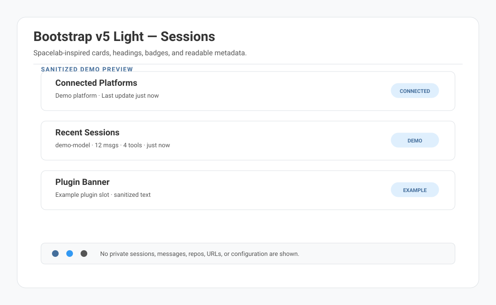
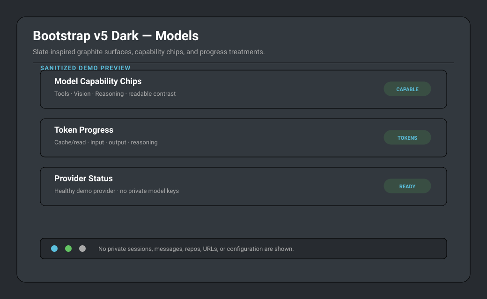
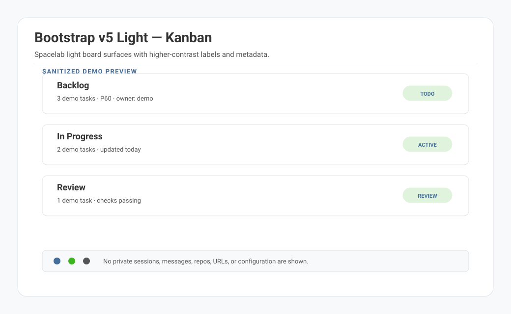
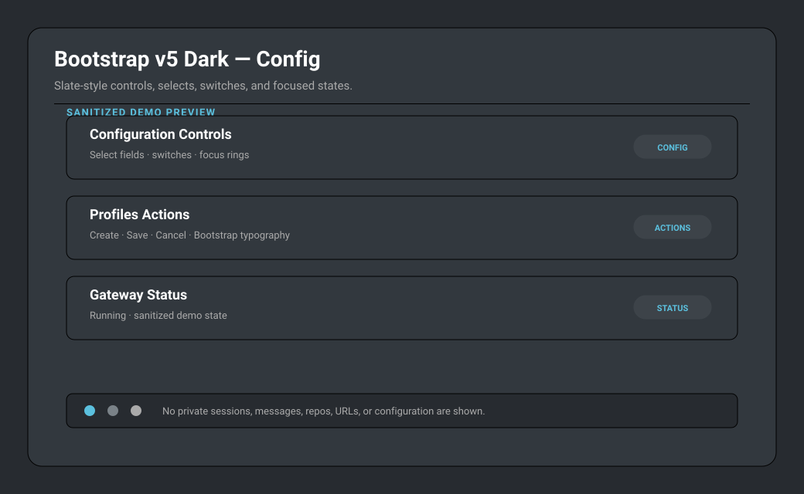

# Hermes Dashboard Bootstrap Themes

Polished Bootstrap 5 and Bootswatch-inspired themes for the [Hermes Agent](https://hermes-agent.nousresearch.com/docs) web dashboard.

This pack includes a light theme inspired by Bootswatch Spacelab and a dark theme inspired by Bootswatch Slate. Both themes are designed for daily dashboard use: readable small text, Bootstrap system fonts, visible focus states, portable YAML files, no remote assets, and dashboard-specific fixes for cards, plugin pages, Kanban, Profiles, Config controls, code blocks, and status views.

## Themes

- `bootstrap-v5-light.yaml` — Bootswatch Spacelab-inspired light mode with dark-theme rendering parity, silvery white surfaces, Spacelab blue actions, readable gray body text, and polished Bootstrap controls.
- `bootstrap-v5-dark.yaml` — Bootswatch Slate-inspired dark mode with graphite surfaces, white links, gray body text, Slate component colors, and Bootstrap-style high-contrast controls.

## Preview

The preview images below are sanitized demo mockups. They show the intended visual direction without exposing local sessions, private repos, messages, or configuration.









## Requirements

- Hermes Agent dashboard with custom dashboard theme support.
- Theme YAML directory: `~/.hermes/dashboard-themes/`.

## Install

Clone or download this repository, then copy the theme files into Hermes' dashboard theme directory:

```bash
mkdir -p ~/.hermes/dashboard-themes
cp themes/bootstrap-v5-*.yaml ~/.hermes/dashboard-themes/
```

Start or refresh the Hermes dashboard:

```bash
hermes dashboard
```

By default the dashboard is available at <http://127.0.0.1:9119>.

Use **Switch theme** in the dashboard sidebar and select either:

- Bootstrap v5 Light
- Bootstrap v5 Dark

## Update

```bash
git pull
cp themes/bootstrap-v5-*.yaml ~/.hermes/dashboard-themes/
```

Refresh the dashboard browser tab after copying updated YAML files.

## Uninstall

```bash
rm -f ~/.hermes/dashboard-themes/bootstrap-v5-light.yaml \
      ~/.hermes/dashboard-themes/bootstrap-v5-dark.yaml
```

Then switch back to another dashboard theme from the sidebar.

## Validate locally

The theme files are plain YAML. Validate them before installing or after editing:

```bash
ruby -e 'require "yaml"; Dir["themes/*.yaml"].sort.each { |f| YAML.load_file(f); puts "ok #{f}" }'
```

If you have PyYAML available, this works too:

```bash
python3 - <<'PY'
from pathlib import Path
import yaml
for path in sorted(Path('themes').glob('*.yaml')):
    yaml.safe_load(path.read_text())
    print(f'ok {path}')
PY
```

## Design notes

- The light theme is inspired by [Bootswatch Spacelab](https://bootswatch.com/spacelab/) v5.3.8 and its public source in [thomaspark/bootswatch](https://github.com/thomaspark/bootswatch/tree/v5/dist/spacelab).
- The dark theme is inspired by [Bootswatch Slate](https://bootswatch.com/slate/) v5.3.8 and its public source in [thomaspark/bootswatch](https://github.com/thomaspark/bootswatch/tree/v5/dist/slate).
- Typography uses Bootstrap's native system font stack.
- Colors track Bootstrap/Bootswatch v5.3 tokens where Hermes' theme schema allows it; the light theme intentionally mirrors the dark theme's component coverage and changes color-bearing values to Spacelab equivalents where practical.
- Dashboard-specific CSS refinements improve daily-use contrast for Sessions, Kanban, Models, Profiles, Config controls, plugins, code blocks, badges, and compact metadata.
- No remote fonts, images, scripts, telemetry, or external assets are required by the themes.

## Compatibility

Tested against Hermes Agent dashboard theme YAML loading from `~/.hermes/dashboard-themes/`.

Recommended release QA coverage:

- Sessions
- Kanban board
- Models
- Config
- Plugins and status cards
- Profiles
- Logs or another code-heavy view
- Gateway/status controls

See [docs/QA.md](docs/QA.md) for the release checklist.

## Privacy and portability

- Theme YAML files contain no secrets, credentials, or personal configuration.
- Preview images are sanitized mockups, not private dashboard captures.
- Local paths in docs use `~/.hermes/...` only.

## Attribution

See [ATTRIBUTION.md](ATTRIBUTION.md) for Bootswatch and Hermes attribution notes.

## License

MIT. See [LICENSE](LICENSE).
